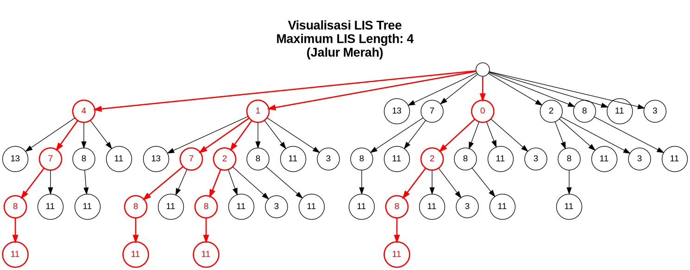

# Praktikum Tegraf Kelompok 14
- Kagendra Amadeo Reynara Pratista (5053241015)
- Danendra Nayottama Hadi (5053241032)

## Program Knight's Tour 
1. Requirements
- Compiler C++ (GCC/G++, Clang, atau MSVC)

2. Jalankan program (pastikan berada di direktori LIS):
```bash
g++ -o knight_tour main.cpp
./knight_tour
```
3. Input ukuran board misal 5
```
5
```
4. Output Merupakan urutan sebuah kuda mengelilingi papan n x n.
(1 merupakan posisi awal, 2 posisi kedua dan seterusnya)  
```
0 5 14 9 20 
13 8 19 4 15 
18 1 6 21 10 
7 12 23 16 3 
24 17 2 11 22 
```


## Program Largest Monotonically Increasing Subsequence

1. Requirements : 
- python 
- graphviz 
2. Jalankan program (pastikan berada di direktori LIS):
```
python3 main.py
```
atau
```
python main.py
```

3. Input Urutan yang bilangan yang mau dicari Subsequence terpanjangnya. Misal 4, 1, 13, 7, 0, 2, 8, 11, 3 maka input :
```
4 1 13 7 0 2 8 11 3
```
4. Output akan menghasilkan sebuah gambar dari sebuah graph tree yang berisi subsequence terpanjang serta panjangnya. Graph dengan garis warna merah menandakan graph terpanjang.


